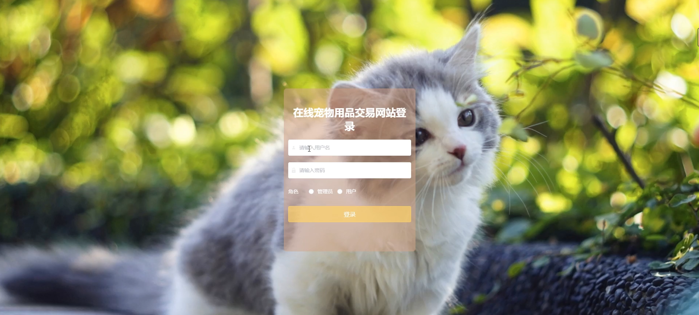

# 基于springboot的在线宠物用品交易网站

---
### 👉作者QQ ：1556708905 微信：zheng0123Long (支持定制修改、部署调试、定制毕设)

### 👉接网站建设、小程序、H5、APP、各种系统等

---

#### 介绍

我开发了一个基于SpringBoot的在线宠物用品交易网站，该系统旨在为宠物爱好者提供一个便捷的在线平台，方便他们购买各种宠物用品。该系统具有两种角色，分别是管理员角色和用户角色，通过不同的功能模块满足不同用户的需求和职责。这一平台不仅优化了宠物用品的购买流程，还提升了用户的购物体验和管理效率。

#### 技术栈

后端技术栈：Springboot+Mysql+Maven

前端技术栈：Vue+Html+Css+Javascript+ElementUI

开发工具：Idea+Vscode+Navicate

#### 系统功能介绍

管理员角色  

个人中心：管理员可以在个人中心查看和编辑个人信息，包括修改密码和更新联系方式，确保个人信息的准确性。  
用户管理：管理员可以管理用户信息，包括用户的注册、删除和信息修改，确保用户数据的及时更新和维护。  
商品分类管理：管理商品分类信息，包括新增、修改和删除分类，便于商品的归类和检索。  
品牌管理：管理员可以管理商品品牌信息，维护品牌的新增、修改和删除，确保品牌信息的准确和完整。  
商品信息管理：管理员可以添加、修改和删除商品信息，并对商品进行详细描述和分类，确保商品信息的准确和丰富。  
系统管理：管理系统设置和参数配置，确保系统的正常运行和维护。  

用户角色  

商品信息：用户可以浏览和查看各类宠物用品的信息，包括价格、描述和库存情况，方便用户进行选择和购买。  
商品资讯：用户可以获取与宠物相关的资讯和新闻，了解最新的宠物护理知识和用品推荐。  
个人中心：用户可以在个人中心查看和编辑个人信息，包括修改密码和更新联系方式，确保个人信息的准确性。  
后台管理：用户可以管理自己的订单、评价、收藏等信息，方便进行查看和操作。  
购物车：用户可以将选中的商品加入购物车，便于统一结算和购买。  
在线客服：用户可以通过在线客服进行咨询，解决购物过程中的问题和疑问。  

#### 系统作用

管理员的作用

提高管理效率：系统提供了全面的管理功能模块，管理员可以高效地管理用户、商品和分类信息，提升整体管理效率。  
数据维护：通过系统管理功能，管理员可以及时更新和维护系统数据，确保系统的稳定运行。  
品牌管理：通过品牌管理模块，管理员可以维护品牌信息，提高品牌的识别度和用户的信任度。  

用户的作用  
 
便捷购物：用户可以通过系统方便地浏览和购买宠物用品，提升购物体验。  
信息获取：用户可以获取最新的宠物资讯和护理知识，提高对宠物的照顾水平。  
个性化管理：用户可以在个人中心管理自己的信息、订单和收藏，方便进行个性化操作和查看。  
问题解决：通过在线客服，用户可以及时解决购物过程中的问题和疑问，提升用户满意度。  

#### 系统功能截图

代码结构

数据库表

登录

商品分类管理

商品信息管理

系统管理

前台页面首页

个人中心

商品信息

商品资讯

购物车

在线客服

订单管理

#### 总结

基于SpringBoot的在线宠物用品交易网站通过分角色的功能设计，满足了不同用户的需求。管理员可以高效地管理用户和商品信息，确保系统的稳定运行和数据的准确维护；用户则可以便捷地进行商品浏览和购买，获取最新的宠物资讯，并通过个性化的后台管理提升购物体验。该系统不仅优化了宠物用品的购买流程，还提升了整体的管理效率和用户满意度，为宠物爱好者提供了一个便捷可靠的在线交易平台。

#### 使用说明

创建数据库，执行数据库脚本 修改jdbc数据库连接参数 下载安装maven依赖jar 启动idea中的springboot项目

后台地址：http://localhost:8080/springbootqi5z1/admin/dist/index.html

管理员  abo 密码 abo

前台地址：http://localhost:8080/springbootqi5z1/front/index.html

